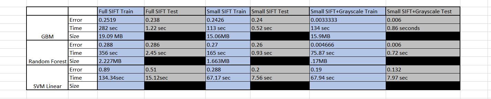

 # Project: Labradoodle or Fried Chicken? In Blakc and White. 


### [Full Project Description](doc/project3_desc.html)

Term: Spring 2017

+ Team # 12
+ Team members
	+ team member 1  Vikas Arun (UNI:va2298) - Presenter
	+ team member 2  Xuanyu Xiao (UNI:xx2243)
	+ team member 3  Boxuan Zhao (UNI:bz2290)
	+ team member 4  Boya Zhao (UNI:bz2294)
	+ team member 5  Yuxi Zhou (UNI:yz3048)

+ Project summary: In this project, we tried to porpose a feasible improvement on the current classification engine for classifying grarscale images of poddle dogs versus images of fried chichen in terms of prediction accuracy as well as running cost, including memory, storage and time. The baseline model uses GBM with 500 trees and 0.1 shrinkage on SIFT features. Our advanced model uses random forest with 500 trees on combination of grayscale and SIFT features, which enhances the accuracy rate by ~20%.

+ Baseline model: GBM model with 500 trees and 0.1 shrinkage on all SIFT features. Test Error 23.8%, training time 282 seconds, storage space 19MB.

+ Improved model: RF model with 500 trees on a few SIFT features + grayscale features. Test Error: 0.06%, training time 75.87 seconds, storage space .17MB.

+ Final result: 
	
**Contribution statement**: ([default](doc/a_note_on_contributions.md)) All team members approve our work presented in this GitHub repository including this contributions statement. 

 + Vikas Arun (UNI:va2298): Developed GBM model and Random Forest models, including cross validation and OOB to find optimal parameters for sift features and enhanced sift and gray features. Explored pixel features on resized images. Wrote dataSplit.R to ensure proper separation of training and test set. Wrote train.R, test.R, and main.Rmd. Created powerpoint presentation for class. 
 
 + Xuanyu Xiao (UNI:xx2243):Used PCA to select features according to AUC score and saved rotation matrix for prediction; Develop k-NN and ANN models in R and k-NN model in python; Testing both original dataset and improved dataset using k-NN and ANN.
 
 + Boxuan Zhao (UNI:bz2290): Developed both SVM linear and non linear models, tune the model parameters to find the best parameters for both orginal sift feature as well as enhanced sift feature and gray feature. Developed enhanced sift features, explored adaboost with decision stump to extract features and particpate in various function modifications to help the project run smoothly.
 
+ Boya Zhao (UNI:bz2294): Used RGB methods to construct feature: grayscale. Constructed monochrome images, then used contour methods to construct feature: location.
 
 + Yuxi Zhou (UNI:yz3048): Tried the RGB & HSV methods in feature detection.

Following [suggestions](http://nicercode.github.io/blog/2013-04-05-projects/) by [RICH FITZJOHN](http://nicercode.github.io/about/#Team) (@richfitz). This folder is orgarnized as follows.

```
proj/
├── lib/
├── data/
├── doc/
├── figs/
└── output/
```

Please see each subfolder for a README file.
