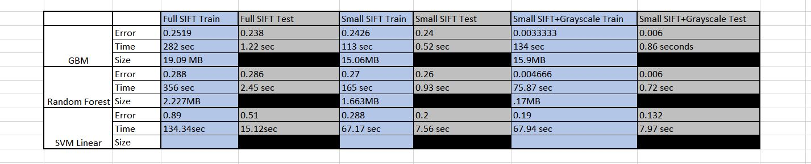

Revlevant packages needed for this file

```{r "package import", message = FALSE, warnings = FALSE}
list.of.packages <- c("e1071", "ggplot2","gbm","caret","randomForest","EBImage")

new.packages <- list.of.packages[!(list.of.packages %in% installed.packages()[,"Package"])]
if(length(new.packages)) 
  {
   install.packages(new.packages)
   source("https://bioconductor.org/biocLite.R")
   biocLite("EBImage")
  }

library("gbm")
library("ggplot2")
library("caret")
library("randomForest")
library("EBImage")
```

### Step 1: specify directories.
This directory should be set to the lib folder of the cloned repository
```{r "setup"}
knitr::opts_knit$set(root.dir = "../lib")
knitr::opts_knit$set(width = 150)
# here replace it with your own path or manually set it in RStudio to where this rmd file is located. 
```

Providing directories for images, sift features, and labels. Providing paths for ouputted models and predictions. 
```{r}
#image_test_dir <- "../data/test_data/raw_images" # This will be modified for different data sets.
#image_train_dir <- "../data/train_data/raw_images"
#img_train_dir <- paste(experiment_dir, "train/", sep="")
#img_test_dir <- paste(experiment_dir, "test/", sep="")
image_all.dir <- "../data/training_data/raw_images"
original_data_train = "../data/sift_ori_train.csv"
original_data_test = "../data/sift_ori_test.csv"
modified_data_train = "../data/sift_simp_gray_train.csv"
modified_data_test = "../data/sift_simp_gray_test.csv"
labels_train = "../data/labels_train.csv"
labels_test = "../data/labels_test.csv"

gbm_model_original_features = "../output/GBMFullFeature.RData"
rf_model_original_features = "../output/RFFullFeature.RData"
gbm_model_modified_features = "../output/GBMModifiedFeature.RData"
rf_model_modified_features = "../output/RFModifiedFeature.RData"

gbm_model_original_predict = "../output/GBMFullFeaturePredictions.csv"
rf_model_original_predict = "../output/RFFullFeaturePredictions.csv"
gbm_model_modified_predict = "../output/GBMModifiedPredictions.csv"
rf_model_modified_predict = "../output/RFModifiedPredictions.csv"
```

### Step 2: set up controls for evaluation experiments.

In this chunk, ,we have a set of controls for the evaluation experiments. 

+ (T/F) cross-validation on the training set for GBM
+ (number) K, the number of CV folds
+ (T/F) Out of Bag Estimate (similar to cross-validation) on training set for Random Forest
+ (T/F) process features for training set
+ (T/F) run evaluation on an independent test set


```{r exp_setup}
run.cv=FALSE # run cross-validation on the training set
K <- 5  # number of CV folds
run.OOB=FALSE
run.feature.train=TRUE # process features for all pictures
run.test=TRUE # run evaluation on an independent test set
#run.feature.test=TRUE # process features for test set
```

Using cross-validation or independent test set evaluation, we compare the performance of different classifiers or classifiers with different specifications. For the GBM model, shrinkage values of .001, .01, and .1 are evaluted, as well as a size limit of 100, 500, and 1000 trees. For the Random Forest model, a size limit of 100, 500, and 1000 trees is evaluted using the Out of Bag (OOB) error estimate, which is similar to cross validation.


### Step 3: construct visual feature for Full images

Features are created by doing two things. 
*First, the number of provided sift features is reduced. Sift feature with standard deviation in the lowest 25th percentile are thrown out. Additionaly for each feature, the mean value for "chicken" images is subtracted from the mean value for "poodle" images. Features, with the absolute value of differences  less than the median are discarded.
*Second, grayscale features are added. For each image, a frequency histogram is created, representing the percentage of pixels falling in each of 256 gray scale bins. As such, each image has 256 grayscale features added.

The data is also split into training and testing data in a 75/25 split. 

```{r "feature", message = FALSE, warnings = FALSE}
source("../lib/feature.R")
source("../lib/DataSplit.R")

tm_feature <- NA
if(run.feature.train){
  #tm_feature <- system.time({
   # dat_all <- feature(img_dir=image_all.dir)})
  #tm_feature <- 
    feature(img_dir=image_all.dir) 
                                     #feature(img_train_dir, 
                                     #                  "train", 
                                      #                 data_name="zip", 
                                       #                export=TRUE))
}

#SPlit the data in to train and test sets

dataSplit.cv()

#tm_feature_train <- NA
#if(run.feature.train){
 # tm_feature_train <- system.time({
  #  dat_train <- feature(img_dir=image_train_dir)})
                                    #feature(img_train_dir, 
                                     #                  "train", 
                                      #                 data_name="zip", 
                                       #                export=TRUE))
#}


#tm_feature_test <- NA
#if(run.feature.test){
 # tm_feature_test <- system.time(dat_test <- feature(img_test_dir, 
  #                                                   "test", 
   #                                                  data_name="zip", 
    #                                                 export=TRUE))
#}

#write(dat_all,file="../output/feature_all.csv")
#save(dat_train, file="./output/feature_train.RData")

#save(dat_test, file="./output/feature_test.RData")
```

### Step 4: Model Training and Parameter Selection
Training the GBM model and Random Forest model on the original features and the new features. Outputed models are stored in RData files in the output folder. Cross validation and OOB parameter estimates are done if requested. 
 
```{r loadlib}
source("../lib/train.R")
source("../lib/test.R")
```

```{r runcv, warning=FALSE}

train_models(original_data_train, labels_train, full_feature = TRUE, run_cv = run.cv, run_OOB = run.OOB, K = K)
train_models(modified_data_train, labels_train, full_feature = FALSE, run_cv = run.cv, run_OOB = run.OOB, K = K)

```

####GBM Cross Validation Results


As can be seen in the above figure, a shrinkage value of 0.1 appears to be the best choice regardless of the number of trees. At a shrinkage value of 0.1, the 500 tree and 1000 tree model have nearly identical errors. 

*What is the best choice of parameters?*
Though the 1000 tree model is slightly better than the 500 tree model when shrinkage is 0.1, the 500 tree model is chosen to avoid overfitting. Additionally, the 500 tree model trains quicker, predicts quicker, and is smaller to store, so given the scenario of creating a phone app, these considerations make the 500 tree model more appropriate.


####Random Forest OOB Results


As expected, the above results show that, as the number of trees increases, the OOB error decreases at a very high rate until it eventually flat lines.

*Choose the best number of trees*
The best number of trees to chose is the least complex model that achieves the best error. The diagram above shows that the error from 500 onwards is fairly flat, and thus we chose to use a 500 tree model for our random forest.


### Step 5: Make predictions on test data

#For original features
Predictions are made by the GBM model and Random Forest model on the original SIFT feature set. These predictions are on the test set, which contain 25% of the original data (i.e. 500 points).
```{r test}
tm_test=NA
if(run.test){

  load(gbm_model_original_features)
  load(rf_model_original_features)
  test_models(tune_gbm, image_rf, original_data_test, full_feature = TRUE)
  rf_predict = read.csv(rf_model_original_predict)$x
  gbm_predict = read.csv(gbm_model_original_predict)$x
  test_labels = unlist(read.csv(labels_test))
  rf_error = sum(rf_predict != test_labels)/length(test_labels)
  gbm_error = sum(gbm_predict != test_labels)/length(test_labels)
  cat("GBM error for original features is ", gbm_error, "/n")
  cat("Random Forest error for original features is, ", rf_error, "/n")
  
  #load(file=paste0("../output/feature_", "zip", "_", "test", ".RData"))
  #load(file="../output/fit_train.RData")
  #tm_test <- system.time(pred_test <- test(fit_train, dat_test))
  #save(pred_test, file="../output/pred_test.RData")
}
```

#For test feature
Predictions are made by the GBM model and Random Forest model on the modified data set, which contains the small subset of SIFT features and additional grayscale features. These predictions are on the test set, which contain 25% of the original data (i.e. 500 points).
```{r test_new_feature}
tm_test=NA
if(run.test){
  load(gbm_model_modified_features)
  load(rf_model_modified_features)
  test_models(tune_gbm, image_rf, modified_data_test, full_feature = FALSE)
  rf_predict = read.csv(rf_model_modified_predict)$x
  gbm_predict = read.csv(gbm_model_modified_predict)$x
  test_labels = unlist(read.csv(labels_test))
  rf_error = sum(rf_predict != test_labels)/length(test_labels)
  gbm_error = sum(gbm_predict != test_labels)/length(test_labels)
  cat("GBM error for modified features is ", gbm_error, "/n")
  cat("Random Forest error for modified features is, ", rf_error, "/n")
  
  #load(file=paste0("../output/feature_", "zip", "_", "test", ".RData"))
  #load(file="../output/fit_train.RData")
  #tm_test <- system.time(pred_test <- test(fit_train, dat_test))
  #save(pred_test, file="../output/pred_test.RData")
}
```

### Summarize Performance of various models
While prediction performance matters, so does the running times for constructing features and testing model, given the scenario limiations of the phone app. We assume training time is not an important factor as training can be done offline on a powerful machine.



The figure above shows the results from training and testing three different feature combinations: 1) The original SIFT data 2) The smaller subset of SIFT data 3) The smaller subset of SIFT Data combined with grayscale data. First focus on the error portion of the gray collumn, which represents training error. One will notice that adding grayscale feature significantly reduced error from ~20% to ~1%. This means, despite removing RGB features, color was still a very important indicator to distinguish between poodles and fried chicken. It is noteable that Linear SVM performs significantly worse than GBM and Random Forest on the third set of features. It is also important to look at the storage size of the blue collumns. This indicates the size required to store the trained model. One will notice than Random Forest takes significantly less space to store than GBM. As such, we chose Random Forest on the third feature set as our model due to its combination of accuracy, small storage size, and quick predicting time.
